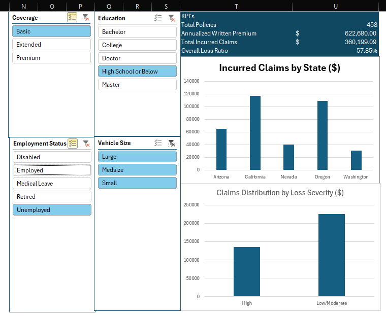

# Motor Claims Portfolio & Risk Reporting Engine

An interactive insurance analytics dashboard built to automate claims processing and dynamic loss-ratio tracking across a 9,100+ policyholder portfolio.

## Overview
Weekly claims and portfolio reporting often suffers from manual data entry, broken spreadsheet formulas, and static views. This project implements an automated, self-updating data model to streamline portfolio risk analysis.

## Key Features
* **Power Query Pipeline:** Ingested and standardized 9,100+ raw policy records, handling type formatting, null values, and severity bucketing automatically.
* **Calculation Engine:** Modelled $13.8M in written premiums against $5.35M in incurred claims (38.8% portfolio loss ratio) across segregated severity tiers.
* **Interactive Risk Slicing:** Linked dynamic slicers to isolate loss ratios instantly by vehicle size, coverage tier, and driver demographics.
* **Operational Efficiency:** New monthly data can be refreshed in one click without formula maintenance.

## Tech Stack
* Microsoft Excel
* Power Query (M)
* Data Modelling
